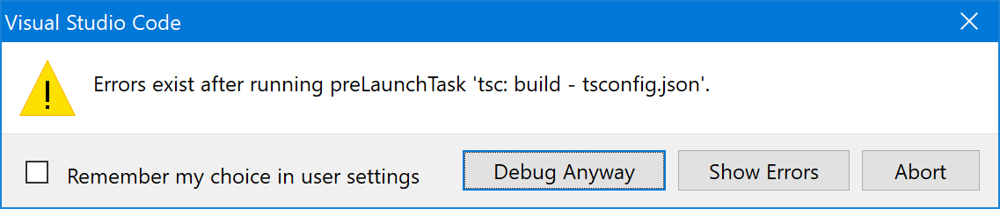

<!-- Documentation for Node.js LB PTI. June 14th, 2021 -->
# Performance Test Interruptible (PTI) for the Node.js Ambrosia Language Binding

<a id="gettingstarted"></a>
## :arrow_forward: Getting Started
PTI is a simple test application that demonstrates using Ambrosia for a basic task (essentially, repeatedly making a simple method call from a 'client' to a 'server' [Immortal instance](https://github.com/microsoft/AMBROSIA#ambrosia-concepts)). PTI is primarily used for smoke, performance, and recovery testing of the Immortal Coordinator (IC) and an Ambrosia language binding (LB) - which together form an Immortal instance, often in an Azure DevOps Continuous Integration (CI) pipeline. There's also a version of PTI for the C# language binding, but this document only concerns the Node.js language binding version which is written in TypeScript (4.3).

There are 3 folders under AmbrosiaJS\PTI:
* App - Contains the PTI TypeScript application, and must be built - for example using [Visual Studio Code](https://code.visualstudio.com/) - before it can be used.
* Client - A convenient way to run the client-side instance of the app (known as 'Job' in the C# version of PTI).
* Server - A convenient way to run the server-side instance of the app.

To build the PTI app:
1. Switch to the ..\Ambrosia-Node folder and run `".\build.ps1"`. This builds the Node.js LB npm package (ambrosia-node-x.x.x.tgz) which PTI uses. If you've recently built this package, you can skip this step.
2. Switch to the PTI\App folder and run `"npm install ..\..\Ambrosia-Node\ambrosia-node-0.0.82.tgz"` (the current version number may by higher).
3. Revert changes to the App\ambrosiaConfig.json file (these arise as a result of installing the ambrosia-node package). Alternatively, you can just copy ambrosiaConfig.json.old over ambrosiaConfig.json. 
4. Using Visual Studio Code, open the PTI\App folder and build. Alternatively, you can build manually from the PTI\App folder by running `"npx tsc -p .\tsconfig.json '--incremental false'"`.

The PTI app is capable of running in 1 of 3 different roles: `Client`, `Server`, and `Combined`.  Which role the app runs in is specified via the "--instanceRole" command-line parameter. To see all available command-line parameters, specify "--help", eg. from the PTI\App folder run `"node .\out\main.js --help"`. Note that which role a parameter applies to is called out in the displayed help syntax.

Be aware that while the PTI app is configured via the command-line, the Node.js LB itself is configured via the `ambrosiaConfig.json` file. By default, the LB will look for this file in the current folder. To use a different `ambrosiaConfig.json`, specify the [optionally pathed] file name using the `ambrosiConfigFile` command-line parameter, eg. `"ambrosiaConfigFile=C:\configs\myAmbrosiaConfig.json"`.

> **Note:** If you are using Visual Studio Code, you can hover over any property in `ambrosiaConfig.json` to see its description.

> **Note:** Currently, PTI does not test 'post' method calls (methods that return values), nor does it test non-post methods that pass JSON parameters. PTI _only_ tests non-post methods that pass a single binary blob parameter (ie. "custom parameter encoding") so its [code coverage](https://en.wikipedia.org/wiki/Code_coverage) of the LB is limited.

&nbsp;

## :vertical_traffic_light: Running PTI

The simplest way to run the PTI app is in the `Combined` role. In this role there is only a single instance which acts as both the client and server, so the app effectively runs in a loop-back configuration where it "only talks to itself". If you run the app directly from Visual Studio Code (ie. from the PTI\App folder), by default, this is the role the app runs in. Because there is only a single instance, it enables easier debugging of both the client-side _and_ server-side of the PTI app. When using Visual Studio Code, the app command-line parameters are specified using the `"args"` setting in `App\.vscode\launch.json`.

If you're not using Visual Studio Code, you can run PTI in the `Combined` role directly from the PTI\App folder. For example:
````PowerShell
node .\out\main.js --instanceRole=Combined --fixedMessageSize --noHealthCheck --expectedFinalBytes=1073741824
````
Because --numOfRounds, --bytesPerRound, and --maxMessageSize are not specified, the app will default to sending 1 round of 1 GB (16,384 messages of 64 KB each) to itself, then the app will exit. If it was sucesssful, the last output message reported will be:

`SUCCESS: The expected number of bytes (1073741824) have been received`

The PTI\Client and PTI\Server folders help make configuration management easier, and simplify how to launch distinct 'client' and 'server' instances (2-party mode). Each folder contains its own ambrosiaConfig.json file, and has a [PowerShell](https://docs.microsoft.com/en-us/powershell/) script (`runClient.ps1` and `runServer.ps1` respectively) that launches the instance with default role-specific app parameters. These default parameters can be overridden (or augmented) from the command-line as needed. Running `".\runClient --help"` displays all the app parameters that will be used, along with the full help syntax for the PTI app (not shown below):

 `Starting PTI with these parameters: --instanceRole=Client --serverInstanceName=PTIServer --help`

To run PTI in 2-party mode (ie. with separate 'client' and 'server' instances):
* Switch to the PTI\Server folder and run `".\runServer"`
* Switch to the PTI\Client folder and run `".\runClient"`

As already noted, these scripts will work without any additional parameters. But here's an example of passing parameters to alter the default behavior. In this case, the client will sends 32 bytes (2 messages of 16 bytes, in a single batch) to the server, which the server then "echoes" back to the client:

````PowerShell
.\runServer.ps1 --bidirectional --noHealthCheck --expectedFinalBytes=32
````
````PowerShell
.\runClient.ps1 --numOfRounds=1 --fixedMessageSize --bytesPerRound=32 --maxMessageSize=16 --batchSizeCutoff=32 --expectedEchoedBytes=32
````

Unlike when running in the `Combined` role, neither instance will automatically exit when the test completes. When either instance is manually stopped, the other instance will report the disconnection as an error. This is expected IC behavior. Note that while it's possible to have more than one client running simultaneously against a given server, there's no automated support for this.

As with all Ambrosia Immortal instances, before an instance can run (in any role) it must be registered. This can be accomplished by running `ambrosia.exe` with the `registerInstance` verb (see [here](https://github.com/microsoft/AMBROSIA/blob/master/Samples/HelloWorld/HOWTO-WINDOWS-TwoProc.md#registering-the-immortal-instances)), or simply by setting the `"autoRegister"` parameter to `true` in ambrosiaConfig.json (to run registration during the app's initialization).  It's also necessary to set the Ambrosia `%AZURE_STORAGE_CONN_STRING%` environment variable (see [here](https://github.com/microsoft/AMBROSIA/blob/master/Samples/HelloWorld/HOWTO-WINDOWS-TwoProc.md#registering-the-immortal-instances)).

> :warning: At a minimum, a separate instance must be registered for <u>each</u> different role (`Client`, `Server`, and `Combined`) you use. If you want to run multiple instances in a given role, then each separate instance will need to be registered. By default, the `Combined` app instance (in PTI\App) uses the instance name "PTICombined", the `Client` app instance (in PTI\Client) uses "PTIClient", and the `Server` app instance (in PTI\Server) uses "PTIServer". If desired, you can change these either by editing the appropriate ambrosiaConfig.json file, or by using the `ambrosiaConfigFile` command-line parameter to make the app use a different ambrosiaConfig.json file which specifies the desired `"instanceName"`.

By default, the app will run with the minimal level of output (console) logging. If you run into problems, you can change the `"outputLoggingLevel"` setting in ambrosiaConfig.json from `"Minimal"` to `"Normal"` to log additional output which is often helpful when troubleshooting.

> :warning: To test recovery, the `"deleteLogs"` setting in ambrosiaConfig.json must be set to `"false"`.

&nbsp;

## :speech_balloon: PTI Explained

The following is a deeper dive into what the PTI app does and how it works. Look in App\src and you will see that the app consists of 2 `.ts` files, and 2 generated `.g.ts` files (which were produced by "code-gen").
> :star: Unlike the C# LB, the Node.js LB doesn't have a separate tool for code-generation, rather it provides a simple code-gen API. Code-generation will be covered in more detail in the ['How the PTI App was Created'](#authoring) section.

* `Main.ts` does command-line parsing/validation then starts the Immortal instance; it also handles code-generation for the "published" Ambrosia methods in `PTI.ts` (a "published" method is a method that is callable by an Ambrosia instance, allowing the method to participate in the guarantees provided by the Ambrosia runtime).
* `PTI.ts` contains all the published methods and application state/logic for both the client and server. It consists of a `State` namespace that contains a special `AppState` class (which is a state object used, in our case, by _both_ client and server), a `ClientAPI` namespace, and a `ServerAPI` namespace.

There are 5 published methods:
* doWork (`ServerAPI`)
* reportState (`ServerAPI`)
* checkHealth (`ServerAPI`)
* continueSendingMessages (`ClientAPI`)
* doWorkEcho (`ClientAPI`)

When the client receives the 'InitialMessage' (from the IC), the LB's `onFirstStart()` event handler is called and this makes the initial self-call to 'continueSendingMessages'. This method builds a batch of server 'doWork' method calls then adds a self-call of 'continueSendingMessages' to the batch as a kind of tail-recursion to continue making progress. It then sends the batch to the [local] IC, which sends the calls (as method-invocation messages) to the server and client instances. As the client completes each "round" of work, it asks the server to report its progress by calling the 'reportState' method. While the server runs, it periodically makes a self-call of the 'checkHealth' method as a "heartbeat" to demonstrate that it remains responsive to incoming messages.

The client sends 'doWork' messages in a series of "rounds". The default is 1 round and is controlled by the --numOfRounds command-line parameter. Each round consists of 1 or more batches, with each batch containing 2 or more 'doWork messages that are of a fixed size. Before starting the next round, the client optionally adjusts the size of the 'doWork' messages by varying the size of the [lone] byte-array parameter (the payload) being passed. The server keeps track of the number and cumulative size of the 'doWork' messages received, with the latter being used to determine whether the test has succeeded (note that checking the integrity of the byte-array parameter received is _not_ part of the test). The --expectedFinalBytes parameter tells the server how many 'doWork' message payload bytes it should expect to receive. If --bidirectional is specified, the server will also "echo" the 'doWork' call back to the client by calling the client's 'doWorkEcho' method; the client can verify the echoed messages by specifying a value for --expectedEchoedBytes.

The command-line parameters that control round/batch production are shown below, and the validation of these parameters (in `Main.ts`) ensures that they always specify a valid test configuration:

<!-- Note: We use the non-breaking hyphen character (&#x2011;) only for --noDescendingSize because its the longest string in the first column, so it prevents wrapping for ALL other values in column #1 -->
<div style="margin-bottom:10px">

Client Parameter | Description (from "--help")
- | -
--numOfRounds | The number of rounds (of size bytesPerRound) to work through; each round will use a [potentially] different message size; defaults to 1
--bytesPerRound | The total number of message payload bytes that will be sent in a single round; defaults to 1 GB
--batchSizeCutoff | Once the total number of message payload bytes queued reaches (or exceeds) this limit, then the batch will be sent; defaults to 10 MB
--maxMessageSize | The maximum size (in bytes) of the message payload; must be a power of 2 (eg. 65536) and be at least 16; defaults to 64KB
&#x2011;&#x2011;noDescendingSize | Disables descending (halving) the message size with after each round; instead, a random size [power of 2] between 16 and &#x2011;&#x2011;maxMessageSize will be used
--fixedMessageSize | All messages (in all rounds) will be of size maxMessageSize; &#x2011;&#x2011;noDescendingSize (if also supplied) will be ignored
</div>

These parameters allow for very simple tests to be created. For example, here's a `Combined` instance test (run from the PTI\App folder) that sends a single batch of 2 x 16 byte messages that are echoed back to the client (note that the "short-form" parameter names are being used in this example):
````PowerShell
node .\out\main.js -ir=Combined -n=1 -bpr=32 -mms=16 -bsc=32 -fms -bd -nhc -efb=32 -eeb=32
````
...or even more simply, by relying on defaults:
````PowerShell
node .\out\main.js -bpr=32 -mms=16 -bsc=32 -fms -bd -nhc
````

In addition to creating simple/quick "smoke" tests like this, the ability to precisely control message production can be used to help narrow down the repro case for an issue. It also makes debugging easier, since when the number of messages involved is small a more detailed `"outputLoggingLevel"` can be specified without resulting in an enormous/unwieldy output log.

Finally, the `"logTriggerSizeInMB"` in ambrosiaConfig.json is set to 256MB so that 4 checkpoints will be taken for every 1GB of messages sent. This allows testing recovery (from a checkpoint) after halting the `Combined`/`Server` instance before the client completes, even in the default case (1 round of 1 GB). This can be changed as needed to suit the needs of the test. Again, regarding recovery, be aware that the `"deleteLogs"` setting in ambrosiaConfig.json is set to `"true"`, so to test recovery this must be changed to `"false"`.

&nbsp;

## :mag_right: Differences with the C# Language Binding version of PTI

While the C# and Node.js PTI apps both test very similar behavior, their differences are worth calling out - especially if you're already familar with the C# version of PTI.

1. The PowerShell scripts `runClient.ps1` and `runServer.ps1` replace  job.exe and server.exe respectively. Further, Node.js PTI supports a single-instanced `Combined` role that simplifies running the test at the expense of testing fewer recovery scenarios (the 'client' and 'server' will always terminate at the same time).

2. There are several additional command-line parameters. Run with "--help" to see what each parameter does, which role they apply to, and - where applicable - what the default value is.
<div style="margin-left:40px; margin-bottom:10px">

--instanceRole\
--serverInstanceName (this replaces --serverName)\
--clientInstanceName (only required when --bidirectional is specified for the server)\
--bytesPerRound (fixed at 1GB in C# PTI)\
--batchSizeCutoff\
--fixedMessageSize\
--noHealthCheck\
--expectedFinalBytes\
--expectedEchoedBytes (specified for the client when --bidirectional is specified for the server)

A couple of command-line parameters also have slightly different semantics:

The --autoContinue parameter defaults to true (not false) and requires a "=true|false" value (unlike C# PTI).\
The --notBidirectional parameter is replaced with --bidirectional, which defaults to false if not specified.
</div>

3. These job.exe/server.exe command-line parameters are supported via ambrosiaConfig.json rather than as PTI app parameters:
<div style="margin-left:40px">

Parameter Name | Equivalent (in ambrosiaConfig.json)
- | -:
--jobName / --serverName | "instanceName"
--receivePort | "icReceivePort"
--sendPort | "icSendPort"
--ICPort | "icCraPort"
--icDeploymentMode | "icHostingMode" _(see note)_
--log | "icLogFolder"
--checkpoint | "debugStartCheckpoint"
</div>

<div style="margin-left:40px; margin-bottom:10px">Note: The available icHostingMode's are not the same as the icDeploymentMode's; loosely, "SecondProc" (C#) corresponds to "Separated" (JS), and "InProcDeploy" corresponds to "Integrated".</div>

4. These server.exe command-line parameters are supported via ambrosiaConfig.json rather than as PTI app parameters:
<div style="margin-left:40px">

Parameter Name | Equivalent (in ambrosiaConfig.json)
- | -:
--numOfJobs | (Not supported)
--upgrading | "upgradeVersion"
--currentVersion | "appVersion"
</div>

&nbsp;

<a id="authoring"></a>
## :bulb: How the PTI App was Created

While not comprehensive, the following describes the "broad strokes" of how the PTI app was created, with an emphasis on the code-generation steps which are unique to the Node.js LB.

After installing the ambrosia-node npm package (see [Getting Started](#gettingstarted)), `PTI.ts` was created. Stubs for the 5 methods to be "published" were written and annotated with a special `@ambrosia` JSDoc tag, like this:

````TypeScript
/** 
 * A method that reports (to the console) the current application state.
 * @ambrosia publish=true, methodID=2
 */
export function reportState(isFinalState: boolean): void
{
}
````
Each published method was manually assigned a unique `methodID` (from 1 to 5) as an attribute of the JSDoc tag. In `Main.ts`, a simple codeGen() function was written that calls the code-gen API (`emitTypeScriptFileFromSource`) in the Node.js LB, specifying `PTI.ts` as the input source file:
````TypeScript
import Ambrosia = require("ambrosia-node"); 
import Meta = Ambrosia.Meta;

async function codeGen()
{
    await Ambrosia.initializeAsync(Ambrosia.LBInitMode.CodeGen);
    Meta.emitTypeScriptFileFromSource("./src/PTI.ts", { apiName: "PTI", fileKind: Meta.GeneratedFileKind.AllKind, mergeType: Meta.FileMergeType.None, outputPath: "./src" });
}
````
When run, this generated the `PublisherFramework.g.ts` and `ConsumerInterface.g.ts` files which could then be imported into `PTI.ts`:
````TypeScript
import * as PublishedAPI from "./ConsumerInterface.g"; // This is a generated file
import * as Framework from "./PublisherFramework.g"; // This is a generated file
````
> **Note:** Only in the case where an Ambrosia app (or service) can be both a 'client' _and_ the 'server' is it necessary to import _both_ the consumer-side (client) and publisher-side (server) generated files.

The 5 stubbed methods were then implemented, since they now had access to the method wrappers (imported from `ConsumerInterface.g.ts`) necessary to call the published functions, eg:

````TypeScript
PublishedAPI.ClientAPI.continueSendingMessages_EnqueueFork(numRPCBytes, iterationWithinRound, startTimeOfRound);
````
The generated `State` namespace in `PublisherFramework.g.ts` was manually moved to `PTI.ts` so that it could be augmented without risk of being overwritten by a subsequent code-gen, and code-gen was run again. Code-gen will detect the move and not re-generate this namespace, and will automatically fix up the [now broken] `State` references in `PublisherFramework.g.ts`.

Any time the name, type, or "shape" of any published entity (like a method) changes, code-gen must be re-run. Because of this, it's usually best to leave your `codeGen()` function in `Main.ts`, even after you switch over to using the app's normal `main()` entry-point. Depending on the changes that were made, it can be necessary to force code-gen to ignore errors in the input source file (`PTI.ts` in our case) by modifying the `fileOptions` parameter of `emitTypeScriptFileFromSource()` to include the `"ignoreTSErrorsInSourceFile: true"` option. Further, the changes may cause compilation errors in the existing PublisherFramework.g.ts and/or ConsumerInterface.g.ts (both of which your app may import) leading to this popup dialog (when running code-gen using VS Code): 

<span style="display: block; text-align: center">Since you are running code-gen (which rebuilds these files), you can typically just click "Debug Anyway" (after confirming that **all** the compile errors are confined to the 2 generated files).</span>

&nbsp;

---
<div>
    <!-- Note: the ADO Markdown previewer can't render SVG or  (even though VS, VSCode and GitHub can) -->
    <!-- Svg from: https://iconcloud.design/browse/Azure%20Icons/Networking/e8b50c8ac-de64dd68d -->
    <svg xmlns="http://www.w3.org/2000/svg" style="float: left; padding-right: 10px" width="70" height="70" viewBox="0 0 18 18"><defs><linearGradient id="ef84663a-a7b6-46a7-a275-1e419f5eae62" x1="9" y1="19.85" x2="9" y2="-1.02" gradientUnits="userSpaceOnUse"><stop offset="0" stop-color="#5e9624"></stop><stop offset="0.02" stop-color="#5f9724"></stop><stop offset="1" stop-color="#76bc2d"></stop></linearGradient></defs><title></title><path d="M.18,8.57,8.57.18a.6.6,0,0,1,.86,0l8.39,8.39a.6.6,0,0,1,0,.86l-8.4,8.4a.6.6,0,0,1-.84,0L.18,9.43A.6.6,0,0,1,.18,8.57Z" fill="url(#ef84663a-a7b6-46a7-a275-1e419f5eae62)"></path><path d="M11.2,4,9.08,1.89a.12.12,0,0,0-.16,0L6.8,4a.1.1,0,0,0,.08.18H8.12a.11.11,0,0,1,.11.11v2a.11.11,0,0,0,.11.11H9.66a.11.11,0,0,0,.11-.11v-2a.11.11,0,0,1,.11-.11h1.24A.1.1,0,0,0,11.2,4Z" fill="#b4ec36"></path><path d="M4,6.61,1.9,8.74a.11.11,0,0,0,0,.15L4,11a.11.11,0,0,0,.19-.08V9.69a.11.11,0,0,1,.11-.11h2a.1.1,0,0,0,.1-.11V8.15A.1.1,0,0,0,6.33,8h-2a.1.1,0,0,1-.11-.1V6.69A.11.11,0,0,0,4,6.61Z" fill="#b4ec36"></path><path d="M14.08,11l2.13-2.12a.11.11,0,0,0,0-.15L14.08,6.61a.11.11,0,0,0-.18.08V7.94a.1.1,0,0,1-.11.1h-2a.1.1,0,0,0-.1.11V9.47a.1.1,0,0,0,.1.11h2a.11.11,0,0,1,.11.11v1.24A.11.11,0,0,0,14.08,11Z" fill="#b4ec36"></path><path d="M11.79,9a2.79,2.79,0,1,0-3.54,2.67v.95a1.71,1.71,0,1,0,1.57,0v-1A2.77,2.77,0,0,0,11.79,9Z" fill="#fff"></path><circle id="e99c3387-15c3-4f28-bd4b-cb209b430e06" cx="9.01" cy="8.99" r="1.62" fill="#5ea0ef"></circle></svg>
    <!-- PNG converter from SVG using Paint3D -->
    <!--
    </img>
    -->
    <div style="font-size:20px; padding-top:5px"><a style="color:inherit; text-decoration: none" href="https://github.com/microsoft/AMBROSIA#ambrosia-robust-distributed-programming-made-easy-and-efficient">AMBROSIA</a></div>
    <div style="font-size:10px; margin-top:-5px;">An Application Platform for Virtual Resiliency</div>
    <div style="font-size:10px; margin-top:-2px;">from Microsoft Research</div>
</div>