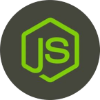

## Ambrosia-Node: A Language Binding for Building Ambrosia Apps/Services for Node.js
----

Ambrosia-Node is a new language binding for Ambrosia&#x00B9; (to learn more about Ambrosia, please read our project **[ReadMe](https://github.com/microsoft/AMBROSIA/blob/master/README.md)**).
A language binding (LB) must exist for each language/runtime you want to build an Ambrosia app or service for, and peviously the only available LB was for C#/.Net. The Node.js LB enables Ambrosia apps/services to now be written for Node.js using TypeScript (4.3 or later). If you're already familiar with building Ambrosia apps using the C# LB, there are some significant differences (and limitations) in the development process, although the concepts (like the need for a code-generation step) remain the same.

&#x00B9; _"AMBROSIA" is an acronym for "Actor Model Based Reliable Object System for Internet Applications", but is referred to in this documentation as "Ambrosia"._ 

## Why use Ambrosia?

When you build an application or service using Ambrosia, it will gain these capabilities:
- Recoverability: If the app/service stops, upon restart it will recover data and program state exactly as it was prior to stopping.
- Migratability: If the app/service is started on another machine, the original instance will stop and the new instance will resume in the exact same state as the original.
- Failover: The app/service can easily be run in an active/active (high availability) configuration, without any app/service code changes.
- "Time-Travel Debugging": The app/service can replay all state changes that led up to the problem, providing a deterministic repro case.

> **Tip:** It's much easier to build an app/service with Ambrosia from the outset than to retrofit an existing app/service with Ambrosia. This is because adopting Ambrosia requires thinking about program design through the lens of deterministic execution, which &ndash; combined with limitations in the Node.js LB itself &ndash; places some significant restrictions on how the app can be developed (see **[Application Design Considerations](docs/Introduction.md#%3Athought_balloon%3A-application-design-considerations)**).

## Documentation

Start exploring the documentation **[here](docs/Introduction.md)**.

## License

Ambrosia is released under an **[MIT license](LICENSE.md)**.

## Contributing Expectations

As of January 2022, Ambrosia-Node is in beta. It has a very small development team behind it, so we have limited resources to service pull-requests. Consequently, please expect slow PR responses. Further, while the language binding remains in beta we are only seeking/accepting bug-fix PRs, not feature additions or architectural enhancements. If you have larger ideas, or just have comments or questions, we invite you to join our **[gitter community](https://gitter.im/AMBROSIA-resilient-systems/Lobby?utm_source=share-link&utm_medium=link&utm_campaign=share-link)**.

## Trademarks

This project may contain trademarks or logos for projects, products, or services. Authorized use of Microsoft trademarks or logos is subject to and must follow the **[Microsoft Trademark and Brand Guidelines](https://www.microsoft.com/en-us/legal/intellectualproperty/trademarks/usage/general)**. Use of Microsoft trademarks or logos in modified versions of this project must not cause confusion or imply Microsoft sponsorship. Any use of third-party trademarks or logos are subject to those third-party's policies.

&nbsp;

---
<table align="left">
  <tr>
    <td>
      
    </td>
    <td>
      

          <a href="https://github.com/microsoft/AMBROSIA#ambrosia-robust-distributed-programming-made-easy-and-efficient">AMBROSIA</a>
      

      An Application Platform for Virtual Resiliency
       
      from Microsoft Research
    </td>
  </tr>
</table>
