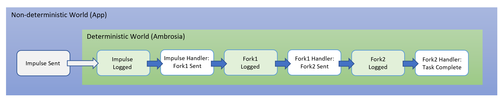

<!-- Note: If using VS Code, install the "bierner.markdown-emoji" extension in order to see emoji's in the built-in MarkDown preview window. -->
## :speech_balloon: The Impulse: Explained
----
When talking about the how software executes there are 2 worlds: a deterministic world (where an ordered sequence of events, once set in motion, is guaranteed to always occur) and an non-deterministic world (where no sequence of events is ever guaranteed to always occur). Programmers generally prefer deterministic software because it provides certainty about how a program will behave every time it runs.

Ambrosia is a framework for writing deterministic software. It is designed so that once a chain of events begins it will always complete, even if – at any point – the application stops. However, even an app that's built using Ambrosia will still need to interact with the non-deterministic world. This includes getting results from a web service, getting keyboard and mouse input from the user, or getting readings from intermittent IoT sensors. The mechanism that Ambrosia provides to let the non-deterministic world coexist with Ambrosia's deterministic world is the **Impulse**.

In the simplest terms, an Impulse is a non-deterministic triggering event for a sequence of deterministic events. Once the deterministic chain has begun, it is invalid to use an Impulse in the chain. Impulses are only for starting deterministic chains.

In Ambrosia, all events – referred to hereafter as messages&#x00B9; – go through the following transitions:

(Sent) &#x2192; (Logged) &#x2192; (Handled)

This is true for both deterministic messages (Forks) and, and non-deterministic messages (Impulses). Once a message has been logged, Ambrosia guarantees that it will reach it's handler. The handler (typically in application code) will then send the next Fork message in the chain, or may send no further messages if the chain is complete.

We now know enough to see an Impulse in action: 

<!-- Slighty convoluted to make it work in both VSCode and ADO -->

Once the Impulse is logged – ie. once the app has successfully entered the deterministic world – then Ambrosia guarantees that the chain of messages/handlers will complete. The key phrase here is 'once the Impulse is logged'. If the app stops before the Impulse is logged, when the log is replayed the chain that the Impulse should have started will not run. 
However, the same is not true of the Fork messages. Since – as can be seen – a logged Fork is _always_ preceded by a handler that will re-send the Fork during log replay, it doesn't matter if the app stops before a Fork message is logged.

This crucial difference is why Impulse messages are only recoverable on a “best effort” basis (ie. only if they make it to the log), whereas Fork messages are _always_ guaranteed to be recoverable.

&#x00B9; _Non-system messages are Remote Procedure Calls (RPCs), and are the application method calls that one instance makes to another instance, including to itself._

 

### Programming with Impulses

During recovery (aka. replay) the ImmortalCoordinator (IC) will replay all logged Impulse messages. As shown above, the handlers for these messages are free to send Fork messages, but they **_must not_** send Impulse messages. It is a violation of the Ambrosia message protocol to send an Impulse during recovery (ie. before the instance has become the Primary), and the Language Binding (LB) will detect this and throw an exception.

When it comes to Impulses, there are two kinds of coding errors to avoid:

1. Sending an Impulse message from either a Fork or Impulse message handler. Impulses should **_never_** originate from Ambrosia message handlers, only from non-deterministic event handlers like timers, web requests, and user input.
2. Sending a Fork message when an Impulse should have been used. Deterministic messages (Forks) should **_never_** originate from non-deterministic event handlers like timers, web requests, and user input - because these events will not determinstically re-occur during replay (ie. they are not deterministically reproducible).

These coding mistakes are essentially two sides of the same coin.

For example, it would be a mistake for the deterministic `Fork1` handler to make a [non-deterministic] web-service call, even if it used a self-call `Impulse2` to log/apply the web-service call result (the `Impulse2` handler would update app state with the result). During recovery this would lead to a deterministic message (`Fork1`) sending an Impulse message (`Impulse2`), which is invalid. One solution would be to acquire _all_ required non-deterministic data first, then pass it in the original Impulse message.

 

### Rules for Writing Message Handlers

As we just saw, the most basic rule of writing an Ambrosia message handler (whether for a Fork or Impulse message) is that it must **_only_** execute deterministic operations. There are several other rules to be aware of:

| &nbsp; | Description |
-|-
**Rule&nbsp;&#35;1** | Messages must be handled - to completion - in the order received. For application (RPC) messages only, if there are messages that are known to be **[commutative](https://en.wikipedia.org/wiki/Commutative_property)** then this rule can be relaxed. 
Reason | Using Ambrosia requires applications to have deterministic execution. Further, system messages (like `TakeCheckpoint`) from the IC rely on being handled in the order they are sent to the app. This means being extremely careful about using non-synchronous code (like awaitable operations and callbacks) inside message handlers. The safest path is to always only use synchronous code.
**Rule&nbsp;&#35;2** | Before a `TakeCheckpoint` message can be handled, all handlers for previously received messages must have completed (ie. finished executing). If Rule &#35;1 is followed, the app is automatically in compliance with Rule &#35;2. 
Reason | Unless your application has a way to capture (and rehydrate) runtime execution state (specifically the message handler stack) in the serialized application state (checkpoint), recovery of the checkpoint will not be able to complete the in-flight message handlers. But if there are no in-flight handlers at the time the checkpoint is taken (because they all completed), then the problem of how to complete them during recovery is moot.
**Rule&nbsp;&#35;3** | Avoid sending too many messages in a single message handler.
Reason | Because a message handler always has to run to completion (see Rule &#35;1), if it runs for too long it can monopolize the system leading to performance issues. Further, this becomes a very costly message to have to replay during recovery. So instead, when an message handler needs to send a large sequence (series) of independent messages, it should be designed to be restartable so that the sequence can pick up where it left off (rather than starting over) when resuming execution (ie. after loading a checkpoint that occurred during the long-running - but incomplete - sequence). Restartability is achieved by sending an application-defined 'sequence continuation' message at the end of each batch, which describes the remaining work to be done. Because the handler for the 'sequence continuation' message only ever sends the next batch plus the 'sequence continuation' message, it can run to completion quickly, which both keeps the system responsive (by allowing interleaving I/O) while also complying with Rule &#35;1. You can see this technique in action in the **[PTI](../../PTI-Node/ReadMe.md#ptiexplained)** app. In addition to this "continuation message" technique for sending a series, if any single message handler has to send a large number of messages it should be sent in batches using either explicit batches (`IC.queueFork` + `IC.flushQueue`) or implicit batches (`IC.callFork` / `IC.postFork`) inside a `setImmediate()` callback. This asynchrony is necessary to allow I/O with the IC to interleave, and is one of the few allowable exceptions to the "always only use asynchronous code" dictate in Rule &#35;1. Interleaving I/O allows the instance to service self-calls, and allows checkpoints to be taken between batches. You can see this technique in action in the `"runForkPerfTest"` command handler in ICTest.ts.
**Rule&nbsp;&#35;4** | A message handler should only use state that comes from one or more of these sources: 1) Checkpointed application state. 2) Method (RPC message) arguments. 3) Runtime state that is repeatably deterministic, ie. that will be identical during both real-time and replay. This includes program state that is [re]computed from checkpointed application state.
Reason | Using only deterministically available/[re]produced state ensures the deterministic integrity of recovery (replay).

 

### Post: Methods (RPC Calls) that Return Values

Both Fork and Impulse messages are "fire and forget", meaning the RPCs they invoke are executed on the destination instance but there is no support for getting a return value from the RPC (method) call. You can certainly build your own "provide return value to caller" method that the destination instance would call on the sender instance, but this would require each outgoing RPC to include the sender instance name as one of its arguments, and overall makes building any application API more cumbersome (2 methods are needed for each method that has a return value). To make getting return values easier, the Node.js LB provides the ability to publish Post methods. The Post method infrastructure is built on top of Fork messages, and is is similar in concept to the Windows PostMessage/WindowProc pattern. Post methods are called using either `IC.postFork()` and `IC.postByImpulse()`, then the return values are handled by the PostResultDispatcher callback passed to `IC.start()`. When the PostResultDispatcher is called, the LB provides the `senderInstanceName`, the `methodName`, the unique `callID`, the `callContextData` (if provided when the call was made), and - finally - the `result` value of the Post method. Additionally, the Post infrastructure provides a per-method timeout mechanism to prevent waiting indefinitely for an unresponsive (or decommissioned) instance, although this behavior can be turned off by setting `"allowPostMethodTimeouts"` to `false` in ambrosiaConfig.json.

> Note that the same rules for message handlers described above also apply to the PostResultDispatcher, since it too is a message handler.

&nbsp;

---
<table align="left">
  <tr>
    <td>
      
    </td>
    <td>
      

        <a href="https://github.com/microsoft/AMBROSIA#ambrosia-robust-distributed-programming-made-easy-and-efficient">AMBROSIA</a>
      

      An Application Platform for Virtual Resiliency
       
      from Microsoft Research
    </td>
  </tr>
</table>