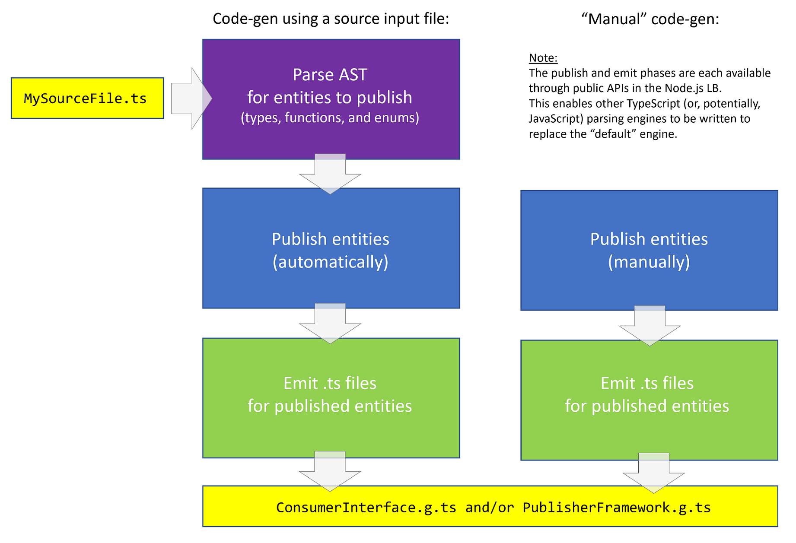

<!-- Note: If using VS Code, install the "bierner.markdown-emoji" extension in order to see emoji's in the built-in MarkDown preview window. -->
## :ballot_box_with_check: Type Checking in the Ambrosia Node.js Language Binding
----
Even though the Node.js LB is written in TypeScript, it contains a significant amount of code devoted to type checking. But why does it need to do type checking at all?

**At publish time…**

1) To check that the types are serializable by the LB's [custom] serializer.
2) To check the structure of the types when publishing "manually" (see diagram below) by calling `publishType()` / `publishMethod()` / `publishPostMethod()` directly (not via code-gen), since types are passed to these methods as strings.

**At runtime…**

1) To improve the debugging experience. For post methods, type errors are returned to the caller (as errors) via the caller's `PostResultDispatcher`. The feedback helps the caller understand if they are calling a method incorrectly. Further, the errors are also written to the output log to provide insights to the publisher about API misuse.
2) The caller may be using an outdated `ConsumerInterface.g.ts`, or may not be using this generated file at all (which opens them up to making type errors). The client may not even be using TypeScript (instead preferring to just call the transpiled .js files directly to use the API), which further increases the risk of introducing a type error when calling a method.
3) Even when using TypeScript, design-time type safety can be easily defeated by simply casting to "any".
4) JavaScript's "truthy" / "falsey" behavior and automatic type coercion can lead to subtle, hard-to-find bugs.  Doing runtime type checking helps find these, and other type-related bugs, more quickly (see the example below).

At publish time, type checking happens in the publish APIs (`publishType`, `publishMethod`, and `publishPostMethod`) as represented by the "Publish entities" boxes below. Doing type checking at this level - rather than at the Abstract Syntax Tree (AST) level - enables type checking to happen regardless of the publishing path used ("automatically" by code-gen, or "manually" by API calls).

<div align="center">
  
</div>

At runtime, the values provided for incoming method parameters are examined and a corresponding type definition is built which is then compared against the published type of the method parameter. Since this can be expensive, when publishing a post method, the "doRuntimeTypeChecking=false" `@ambrosia` attribute can be specified to opt the method out of runtime type checking (it will still be checked at publish time, ie. during code-gen). Runtime type checking doesn't happen for non-post methods because only post methods provide a way (the `PostResultDispatcher`) to communicate a type-mismatch back to the caller, which is the main reason for doing runtime type checking.

As a simple example of how runtime type checking can help with JavaScript's "truthy" / "falsey" behavior, consider a post method defined like this…

````TypeScript
Meta.publishType("Digits", "{ count: number }");
Meta.publishPostMethod("ComputePI", 1, ["digits?: Digits"], "number");
````

…but incorrectly called like this (the supplied value of the `count` property is `false` when the published definition calls for a `number` value):

````TypeScript
IC.postFork(IC.instanceName(), "ComputePI", 1, -1, null, IC.arg("digits?", { count: false }));
````

If the LB didn't do runtime type checking, this method would "accidentally" succeed because JavaScript would coerce `false` to the number `0`. However, the returned result is unlikely to be what the caller either expected or intended. But with runtime type checking, the caller gets a precise, actionable error:

`Error: Post method 'ComputePI' (callID 2) sent to 'server' failed (reason: Argument 'digits?' is of the wrong type ({ count: boolean }); type of 'count' should be 'number', not 'boolean')`

&nbsp;

---
<table align="left">
  <tr>
    <td>
      
    </td>
    <td>
      <div>
          <a href="https://github.com/microsoft/AMBROSIA#ambrosia-robust-distributed-programming-made-easy-and-efficient">AMBROSIA</a>
      </div>
      <sub>An Application Platform for Virtual Resiliency</sub>
      <br/>
      <sub>from Microsoft Research</sub>
    </td>
  </tr>
</table>