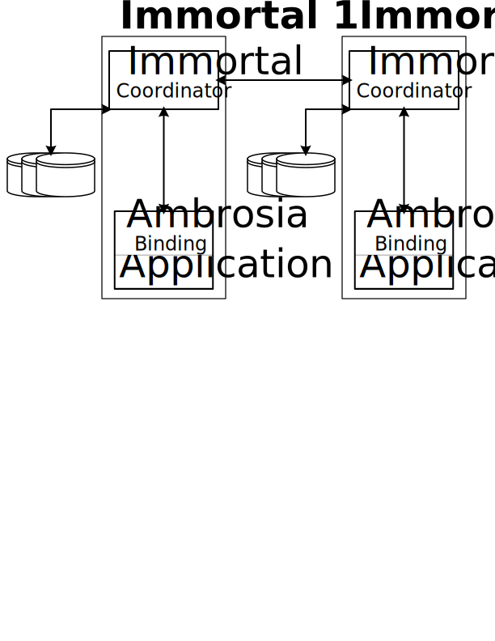

Ambrosia: Highly Robust Distributed Programming Made Easy and Efficient
=======================================================================

 * Windows Build (net46/netcore) [](https://msrfranklin.visualstudio.com/Franklin/_build/latest?definitionId=23)

 * Linux Build (netcore) [](https://msrfranklin.visualstudio.com/Franklin/_build/latest?definitionId=24)

 * Linux Docker Build: [](https://msrfranklin.visualstudio.com/Franklin/_build/latest?definitionId=18) 


Ambrosia is a programming language independent approach for authoring
and deploying highly robust distributed applications. Ambrosia 
dramatically lowers development and deployment costs and time to
market by automatically providing recovery and high availability.

Today's datacenter oriented applications, which include most popular
services running in the cloud today, are composed of highly complex,
distributed software stacks. For instance, they typically incorporate
Event Hub or Kafka to robustly journal input and interactions for
recoverability, log important information to stores like Azure blobs
for debuggability, and use extremely expensive mechanisms like
distributed transactions, and stateless functions with distributed
persistent back-ends, in order to ensure exactly once execution of
service code.

In contrast, Ambrosia automatically gives programmers recoverability,
high availability, debuggability, upgradability, and exactly once
execution, without requiring developers to weave together such complex
systems, or use overly expensive mechanisms.

To learn more about Ambrosia's implementation and performance you can read our [whitepaper](https://www.microsoft.com/en-us/research/publication/a-m-b-r-o-s-i-a-providing-performant-virtual-resiliency-for-distributed-applications/).

Table of Contents
-----------
* [AMBROSIA Concepts](#ambrosia-concepts)
* [How it works](#how-it-works)
* [Features](#features)
* [Getting started]()
    * [Windows]()
    * [Kubernetes]()
* [Reference](#reference)
    * [Language Support](#language-support)
    * [Usage](#usage)
    
## AMBROSIA Concepts

### Virtual Resiliency
> *Virtual Resiliency* is a mechanism in a (possibly distributed) programming and execution environment, typically employing a log, which exploits the replayably deterministic nature and serializability of an application to automatically mask failure.

We use the term virtual resiliency to describe the mechanism in AMBROSIA that allows programmers to write their applications in a failure oblivious way, removing the need for application writers to write logic for recovery or state protection. Data processing systems, which typically express their queries in SQL variants, have provided their query writers virtual resiliency for decades. Map-reduce systems, which don’t necessarily use SQL, also provide this capability. Note that in all these cases, this feature leverages the ability to deterministically replay, like AMBROSIA.

### Deterministic Replayability
In order to achieve virtual resiliency through AMBROSIA, applications but uphold the following contract: from some initial state, any execution of the same requests in the same order results in both the *same final state*, as well as the *same outgoing requests in the same order*.

### Immortals
The basic building blocks of AMBROSIA are *Immortals*, reliable distributed objects that communicate through RPCs. An Immortal defines a set of persistent state and a set of RPC handlers that operate on that state. An *instance* of an Immortal is a named entity that maintains state and executes RPC handlers according to the Immortal's definition. An AMBROSIA application often has multiple instances of the same Immortal; for example, an application may define a single "job" Immortal for running a data-processing job and run multiple instances of that job operating on different data sets.

## How it works
The figure below outlines the basic architecture of an AMBROSIA application, showing two communicating AMBROSIA services, called Immortals. Each inner box in the figure represents a separate process running as part of the Immortal. Each instance of an Immortal exists as a software object and thread of control running inside of an application process. An Immortal instance communicates with other Immortal instances through an *Immortal Coordinator* process, which durably logs the instance's RPCs and encapsulates the low-level networking required to send RPCs. The position of requests in the log determines the order in which they are submitted to the application process for execution and then re-execution upon recovery.



In addition, the language specific AMBROSIA binding provides a state serializer. To avoid replaying from the start of the service during recovery, the Immortal Coordinator occasionally checkpoints the state of the Immortal, which includes the application state. The way this serialization is provided can vary from language to language, or even amongst bindings for the same language.

## Features
Here is a list of features that AMBROSIA provides to application developers and deployers:

* Register Instance, Add Replica
* Debug Instance
* Active Active
* Live Upgrades, Test Upgrades
* RPC
* Asynchronous RPC (beta)

Quick Start: Fetch a binary distribution
----------------------------------------

FINISHME - 


Quick Start: Build from Source
------------------------------

Build the Ambrosia Immortal coordinator and C# client code generator
with this Bash script:

    ./build_dotnetcore_bindist.sh

Given a .NET Core SDK, this will work on Windows, Mac OS, or Linux.
After that, you have an AMBROSIA binary distribution built inside the
`./bin` directory within your working copy.

Running a Sample
----------------

FINISHME - AmbrosiaDocs.md content will move here!!

## Reference

### Language Support
AMBROSIA currently supports C# on both .NET Core and .NET Framework. We plan to exand this support with AMBROSIA bindings for other languages in the future. 

### Usage
```
Usage: Ambrosia.exe RegisterInstance [OPTIONS]
Options:
  -i, --instanceName=VALUE   The instance name [REQUIRED].
      --rp, --receivePort=VALUE
                             The service receive from port [REQUIRED].
      --sp, --sendPort=VALUE The service send to port. [REQUIRED]
  -l, --log=VALUE            The service log path.
      --cs, --createService=VALUE
                             [A - AutoRecovery | N - NoRecovery | Y -
                               AlwaysRecover].
      --ps, --pauseAtStart   Is pause at start enabled.
      --npl, --noPersistLogs Is persistent logging disabled.
      --lts, --logTriggerSize=VALUE
                             Log trigger size (in MBs).
      --aa, --activeActive   Is active-active enabled.
      --cv, --currentVersion=VALUE
                             The current version #.
      --uv, --upgradeVersion=VALUE
                             The upgrade version #.
  -h, --help                 show this message and exit
Usage: Ambrosia.exe AddReplica [OPTIONS]
Options:
  -r, --replicaNum=VALUE     The replica # [REQUIRED].
  -i, --instanceName=VALUE   The instance name [REQUIRED].
      --rp, --receivePort=VALUE
                             The service receive from port [REQUIRED].
      --sp, --sendPort=VALUE The service send to port. [REQUIRED]
  -l, --log=VALUE            The service log path.
      --cs, --createService=VALUE
                             [A - AutoRecovery | N - NoRecovery | Y -
                               AlwaysRecover].
      --ps, --pauseAtStart   Is pause at start enabled.
      --npl, --noPersistLogs Is persistent logging disabled.
      --lts, --logTriggerSize=VALUE
                             Log trigger size (in MBs).
      --aa, --activeActive   Is active-active enabled.
      --cv, --currentVersion=VALUE
                             The current version #.
      --uv, --upgradeVersion=VALUE
                             The upgrade version #.
  -h, --help                 show this message and exit
Usage: Ambrosia.exe DebugInstance [OPTIONS]
Options:
  -i, --instanceName=VALUE   The instance name [REQUIRED].
      --rp, --receivePort=VALUE
                             The service receive from port [REQUIRED].
      --sp, --sendPort=VALUE The service send to port. [REQUIRED]
  -l, --log=VALUE            The service log path.
  -c, --checkpoint=VALUE     The checkpoint # to load.
      --cv, --currentVersion=VALUE
                             The version # to debug.
      --tu, --testingUpgrade Is testing upgrade.
  -h, --help                 show this message and exit
```